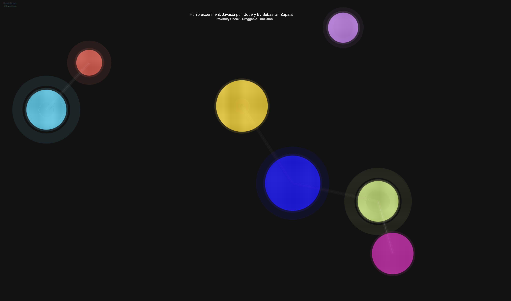

# Pulsing balls experiment

A javascript experimental code that creates native draggable pulsing balls with proximity awareness

# Make it work!

1. Clone the project

2. Click to index.html

3. Enjoy it!

